# 红迪照相馆

## 搬家地图

```mermaid
flowchart TB
    chonglangTV["r/chonglangTV
    2019/05/29 - 2022/03/01
    "]

    chonglangTV --- chonglangTV_t@{ shape: text, label: "2022/03/01<br>开盒被封" }
    chonglangTV_t --> | 迪 | CLTV
    chonglangTV_t --> | 沟 | SewerFarm

    %% 迪
    CLTV["r/CLTV
    2021/01/27 - 2022/05/31
    "]
    QuanLangTV["r/QuanLangTV
    2021/12/27 - 2022/08/23
    "]

    CLTV --- CLTV_t@{ shape: text, label: "2022/05/31<br>mod在r/liutiaomao所述<br>举办太多跟水沟一换一" }
    CLTV_t --> QuanLangTV
    QuanLangTV --- QuanLangTV_t@{ shape: text, label: "2022/06/20<br>mod下台后转私密<br>2022/08/24<br>无人管理被封" }
    QuanLangTV_t --> | 包蜜 | baomitv
    QuanLangTV_t --> | 右狗 | rightdogTV
    QuanLangTV_t --> | 默 | YoumoTV
    QuanLangTV_t -->  | 斗 | DouyuTV
    QuanLangTV_t -->  | 图 | TZTV
    QuanLangTV_t --> | 穴 | Thuhole

    %% 沟
    SewerFarm["r/SewerFarm
    2022/03/31 - 2022/05/31
    "]
    geltopia["r/geltopia
    2022/04/22 - 2024/02/09
    "]

    SewerFarm --- SewerFarm_t@{ shape: text, label: "2022/05/31<br>得到派主席证实<br>被左理解举办炸掉" }
    SewerFarm_t --> geltopia
    geltopia --- geltopia_t@{ shape: text, label: "2024/02/09<br>主动转私密" }

    %% 包蜜
    baomitv["r/baomitv
    2022/05/12 - 2022/08/23
    "]

    baomitv --- baomitv_t@{ shape: text, label: "2022/08/24<br>板块转生" }

    %% 右狗
    rightdogTV["r/rightdogTV
    2022/04/27 - 2022/08/23
    "]

    rightdogTV --- rightdogTV_t@{ shape: text, label: "2022/08/24<br>连坐" }

    %% 默
    YoumoTV["r/YoumoTV
    2022/06/20 - 2022/09/01
    "]
    Youmo["r/Youmo
    2022/08/23 - 2023/08/31
    "]
    realYoumo["r/realYoumo
    2023/06/24 - 2023/11/28
    "]
    hangkongmujian["r/hangkongmujian
    2023/06/28 - 2024/01/03
    "]
    JunWuCiWeiMian["r/JunWuCiWeiMian
    2024/01/03 - 2024/02/28
    "]
    langrenClub["r/langrenClub
    2023/09/30 - 2024/05/22
    "]
    RoninClub["r/RoninClub
    2024/05/21 - 2024/07/11
    "]
    beiouxiaozhen["r/beiouxiaozhen
    2022/03/01 - 2024/09/16
    "]
    Sina["r/Sina
    2016/01/16 - 2024/09/19
    *2024/05/23占领*
    "]
    guiwushenyouhui["r/guiwushenyouhui
    2022/02/13 - 2024/09/18
    "]
    abstract_garden["r/abstract_garden
    2024/07/17 - 2024/10/05
    "]

    YoumoTV --- YoumoTV_t@{ shape: text, label: "2022/09/02<br>mod辉被封号<br>无人管理被封" }
    YoumoTV_t --> Youmo
    Youmo --- Youmo_t@{ shape: text, label: "2023/08/31<br>辉被集美举办至r/China<br>惊动超管被封" }
    Youmo_t --> realYoumo
    realYoumo --- realYoumo_t@{ shape: text, label: "2023/11/29<br>板块转生" }
    realYoumo_t --> hangkongmujian
    hangkongmujian --- hangkongmujian_t@{ shape: text, label: "2024/01/04<br>板块转生" }
    hangkongmujian_t --> JunWuCiWeiMian
    JunWuCiWeiMian --- JunWuCiWeiMian_t@{ shape: text, label: "2024/02/29<br>板块转生" }
    JunWuCiWeiMian_t --> langrenClub
    langrenClub --- langrenClub_t@{ shape: text, label: "2024/05/23<br>板块转生" }
    langrenClub_t --> RoninClub
    RoninClub --- RoninClub_t@{ shape: text, label: "2024/07/11<br>板块转生" }
    RoninClub_t --> beiouxiaozhen
    beiouxiaozhen --- beiouxiaozhen_t@{ shape: text, label: "2024/09/17<br>板块转生" }
    beiouxiaozhen_t --> abstract_garden
    langrenClub_t --> Sina
    Sina --- Sina_t@{ shape: text, label: "2024/09/20<br>板块转生" }
    Sina_t --> abstract_garden
    langrenClub --> guiwushenyouhui
    guiwushenyouhui --- guiwushenyouhui_t@{ shape: text, label: "2024/09/18<br>主动转私密" }
    abstract_garden --- abstract_garden_t@{ shape: text, label: "2024/10/05<br>板块转生" }

    %% 斗
    DouyuTV["r/DouyuTV
    2022/05/16 - 2022/09/22
    "]

    DouyuTV --- DouyuTV_t@{ shape: text, label: "2022/09/23<br>板块转生" }

    %% 图
    TZTV["r/TZTV
    2021/09/08 - 2023/02/14
    "]
    CLTV8964["r/CLTV8964
    2022/08/30 - 2023/05/03
    "]
    langren["r/langren
    2022年12月 ~ 2023年9月
    _只能查到一个2024年5月建立的无人sub_
    "]
    langyou["r/langyou
    2023/01/26 - 2023/10/02
    "]

    TZTV --- TZTV_t@{ shape: text, label: "2023/02/15<br>左理解大量举办" }
    TZTV_t --> CLTV8964
    CLTV8964 --- CLTV8964_t@{ shape: text, label: "2023/05/03<br>板块转生" }
    CLTV8964_t --> langren
    langren --- langren_t@{ shape: text, label: "2023/09<br>板块转生" }
    langren_t --> langyou
    langyou --- langyou_t@{ shape: text, label: "2023/10/02<br>板块转生" }

    %% 穴
    Thuhole["r/Thuhole
    2021/07/26 - 2023/06/20
    "]
    NEWTo_Cave["r/NEWTo_Cave
    2023/09/06 - 2024/07/11
    "]
    NEW_To_Cave["r/NEW_To_Cave
    2024/06/01 - 2025/08/06
    "]
    Cunicle["r/Cunicle
    2024/08/14 - 2025/07/15
    "]
    Sin_Game["r/Sin_Game
    2025/08/05 - 2025/12/15
    "]

    Thuhole --- Thuhole_t@{ shape: text, label: "2023/06/20<br>板块被封" }
    Thuhole_t --> NEWTo_Cave
    NEWTo_Cave --- NEWTo_Cave_t@{ shape: text, label: "2024/07/11<br>板块被封" }
    NEWTo_Cave_t --> NEW_To_Cave
    NEW_To_Cave --- NEW_To_Cave_t@{ shape: text, label: "2025/08/06<br>板块被封" }
    NEW_To_Cave_t --> Sin_Game
    NEWTo_Cave -.-> | 兔 | Cunicle
    Cunicle --- Cunicle_t@{ shape: text, label: "2025/07/15<br>板块连坐被封" }
    Cunicle_t --> Sin_Game
    Sin_Game --- Sin_Game_t@{ shape: text, label: "2025/12/15<br>Mod销号转受限" }

    %% 年轻动物~年轻冠军
    YoungAnimalJapan["r/YoungAnimalJapan
    2021/02/26 -2024/11/07
    *2024/10/06占领*
    "]
    abstractmemes["r/abstractmemes
    2017/08/22 - 2025/02/12
    *2024/10/20占领*
    "]
    WeeklyPlayboyJapan["r/WeeklyPlayboyJapan
    2021/02/18 - 2025/03/01
    *2025/02/06占领*
    "]
    Reddit5050challenge["r/Reddit5050challenge
    2020/06/07 - 2025/04/02
    *2025/03/01占领*
    "]
    NotMeantToBeFunny["r/NotMeantToBeFunny
    2019/07/14 - 2025/05/10
    *2025/04/02占领*
    "]
    YoungChampion["r/YoungChampion
    2021/02/17 - 2025/05/30
    *2025/05/10占领*
    "]

    abstract_garden_t --> YoungAnimalJapan
    YoungAnimalJapan --- YoungAnimalJapan_t@{ shape: text, label: "2024/11/07<br>板块被封" }
    YoungAnimalJapan_t --> abstractmemes
    abstractmemes --- abstractmemes_t@{ shape: text, label: "2025/02/12<br>板块被封" }
    abstractmemes_t --> WeeklyPlayboyJapan
    WeeklyPlayboyJapan --- WeeklyPlayboyJapan_t@{ shape: text, label: "2025/03/01<br>板块被封" }
    WeeklyPlayboyJapan_t --> Reddit5050challenge
    Reddit5050challenge --- Reddit5050challenge_t@{ shape: text, label: "2025/04/02<br>板块被封" }
    Reddit5050challenge_t --> NotMeantToBeFunny
    NotMeantToBeFunny --- NotMeantToBeFunny_t@{ shape: text, label: "2025/05/10<br>板块被封" }
    NotMeantToBeFunny_t --> YoungChampion
    YoungChampion --- YoungChampion_t@{ shape: text, label: "2025/05/30<br>板块被封" }
    YoungChampion_t --> FLASHJapan

    %% 闪日~杉原杏璃
    FLASHJapan["r/FLASHJapan
    2021/02/26 - 2025/07/15
    *2025/05/30占领*
    "]
    HumorSub["r/HumorSub
    2019/07/10 - 2025/09/10
    *2025/03/01占领*
    "]
    YoungGangan["r/YoungGangan
    2021/02/18 - 2025/08/25
    *2025/07/15占领*
    "]
    AmyYip["r/AmyYip
    2020/02/24 - 2025/08/19
    *2025/08/07占领*
    "]
    WeeklyYoungJumpMag["r/WeeklyYoungJumpMag
    2021/02/26 - 2025/08/25
    *2025/08/19占领*
    "]
    YoungAnimalArashi["r/YoungAnimalArashi
    2021/02/16 - 2025/09/10
    *2025/08/26占领*
    "]
    CapybaraHome["r/CapybaraHome
    2025/08/07 - 2025/09/10
    "]
    FansOfAnriSugihara["r/FansOfAnriSugihara
    2021/07/11 - 2025/09/18
    *2025/09/10占领*
    "]

    FLASHJapan --- FLASHJapan_t@{ shape: text, label: "2025/07/15<br>板块被封" }
    FLASHJapan_t --> HumorSub
    HumorSub --- HumorSub_t@{ shape: text, label: "2025/07/15<br>转私密躲避追查<br>2025/09/10<br>板块连坐被封" }
    HumorSub_t ---> YoungGangan
    FLASHJapan_t --> YoungGangan
    YoungGangan --- YoungGangan_t@{ shape: text, label: "2025/08/07<br>转私密躲避追查<br>2025/08/25<br>板块连坐被封" }
    YoungGangan_t --> AmyYip
    AmyYip --- AmyYip_t@{ shape: text, label: "2025/08/19<br>转私密躲避追查<br>2025/08/22<br>板块被封" }
    AmyYip_t --> WeeklyYoungJumpMag
    WeeklyYoungJumpMag --- WeeklyYoungJumpMag_t@{ shape: text, label: "2025/08/25<br>板块被封" }
    WeeklyYoungJumpMag_t --> YoungAnimalArashi
    YoungAnimalArashi --- YoungAnimalArashi_t@{ shape: text, label: "2025/09/10<br>板块被封" }
    YoungAnimalArashi_t ---> FansOfAnriSugihara
    YoungGangan -.-> CapybaraHome
    CapybaraHome --- CapybaraHome_t@{ shape: text, label: "2025/09/10<br>板块连坐被封" }
    CapybaraHome_t --> FansOfAnriSugihara
    FansOfAnriSugihara --- FansOfAnriSugihara_t@{ shape: text, label: "2025/09/18<br>板块被封" }
    FansOfAnriSugihara_t --> windows10iot

    %% windows10iot~现在
    windows10iot["r/windows10iot
    2025/09/21 - 2025/09/26
    *Mod权限都没有就强行占领，还引流了一波印度人进来瞎骂*
    "]
    kfq["r/kfq
    2025/09/26 - 2026/02/13
    *原备份开放区帖子的sub，被夺舍后成为土耳其人和浪人共存的sub*
    "]
    HomeofChonglang["r/HomeofChonglang
    2021/03/14 - 2026/02/13
    *2025/09/27原Mod回归，重新开放的旧家*
    "]
    KaiFangQu["r/KaiFangQu
    2026/02/13 - 2026/02/14
    "]

    windows10iot --- windows10iot_t@{ shape: text, label: "2025/09/26<br>原Mod下场删帖清场" }
    windows10iot_t --> kfq
    kfq --- kfq_t@{ shape: text, label: "2026/02/13<br>板块被封" }
    kfq_t --> KaiFangQu
    windows10iot -.-> HomeofChonglang
    HomeofChonglang --- HomeofChonglang_t@{ shape: text, label: "2026/02/13<br>板块连坐被封" }
    HomeofChonglang_t --> KaiFangQu
    KaiFangQu --- KaiFangQu_t@{ shape: text, label: "2026/02/14<br>板块被封" }

    %% 其他
    LTTV["r/LTTV
    2021/04/30 - 2022/06/18
    "]
    Liutiaogou["r/Liutiaogou
    2021/11/04 - 2022/06/22
    "]
    chonglanggoosegroup["r/chonglanggoosegroup
    2021/12/05 - 2023/03/08
    "]
    bigpigTV["r/bigpigTV
    2022/05/19 - 2023/12/04
    "]
    zhinvIRL["r/zhinvIRL
    2022/06/13 - 2023/06/19
    "]
    HarukaNaSora["r/HarukaNaSora
    2021/04/19 - 2024/04/22
    *2024/02/21占领*
    "]
    FakeYoumo["r/FakeYoumo
    2024/04/07 - 2025/10/08
    "]
    Classic_Youmo["r/Classic_Youmo
    2023/09/01 - now
    "]

    LTTV --- LTTV_t@{ shape: text, label: "2022/08/08<br>无人管理被封" }
    LTTV_t ~~~ Liutiaogou
    Liutiaogou --- Liutiaogou_t@{ shape: text, label: "2022/07/07<br>无人管理被封" }
    Liutiaogou_t ~~~ chonglanggoosegroup
    chonglanggoosegroup --- chonglanggoosegroup_t@{ shape: text, label: "2023/03/08<br>板块被封" }
    chonglanggoosegroup_t ~~~ bigpigTV
    bigpigTV --- bigpigTV_t@{ shape: text, label: "2023/12/04<br>无人管理被封" }
    bigpigTV_t ~~~ zhinvIRL
    zhinvIRL --- zhinvIRL_t@{ shape: text, label: "2023/06/20<br>板块被封" }
    zhinvIRL_t ~~~ HarukaNaSora
    HarukaNaSora --- HarukaNaSora_t@{ shape: text, label: "2024/04/22<br>板块被封" }
    HarukaNaSora_t ~~~ FakeYoumo
    FakeYoumo --- FakeYoumo_t@{ shape: text, label: "2025/10/08<br>无人管理被封" }
    FakeYoumo_t ~~~ Classic_Youmo
    Classic_Youmo --- Classic_Youmo_t@{ shape: text, label: "现存" }
    
    %% 现存
    ChinaTr["r/ChinaTr
    2026/02/14 - now
    "]
    Bagabondo["r/Bagabondo
    2025/12/22 - now
    "]
    
    KaiFangQu_t --> ChinaTr
    ChinaTr --- ChinaTr_t@{ shape: text, label: "现存" }
    KaiFangQu_t --> Bagabondo
    Bagabondo --- Bagabondo_t@{ shape: text, label: "现存" }
```

## 参考链接

- https://chonglangtv.pythonanywhere.com/
- https://ivonblog.com/posts/home-of-chonglangtv/
- https://ghostarchive.org/archive/vQN76

## 已知问题

- 无法获取sub设置为私密期间的发贴
- 缺失r/langren的全部发帖和评论
- 部分sub数据不完整
    - r/DouyuTV缺少2022年9月1日~9月23日的数据
    - r/TZTV缺少2023年2月1日~2月14日的数据
    - r/chonglanggoosegroup缺少2023年2月1日~3月8日的数据
    - r/Youmo缺少2023年7月6日~2023年8月31日的数据
- 以下sub可能仍缺失部分数据 [^1]
    - r/chonglangTV不全
    - r/CLTV不全
    - r/SewerFarm不全
    - r/QuanLangTV缺少2021年9月9日~12月28日和2022年5月30日~2022年6月20日的数据
    - r/baomitv, r/rightdogTV缺少2022年8月1日~8月23日的数据
    - r/YoumoTV缺少2022年8月1日~9月2日的数据

[^1]: 已经从 [downloadTV](https://chonglangtv.pythonanywhere.com/) 找到部分数据备份
